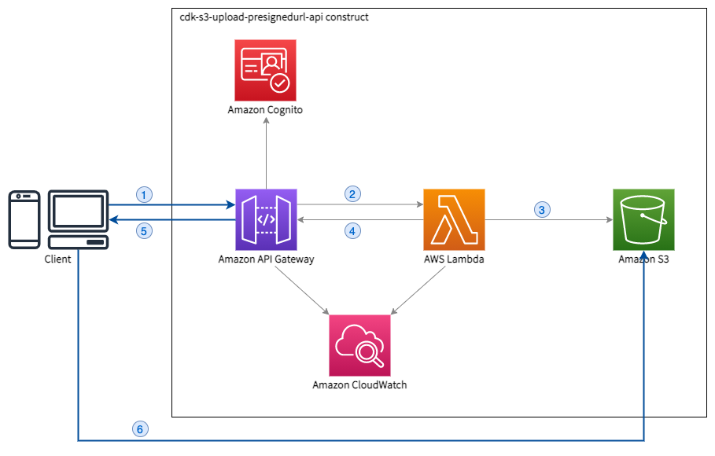

# cdk-s3-upload-presignedurl-api

  

cdk-s3-upload-presignedurl-api is AWS CDK construct library that create an API to get a presigned url to upload a file in S3.

## Background

In web and mobile applications, it's common to provide the ability to upload data (documents, images, ...). Uploading files on a web server can be challenging and AWS recommends to upload files directly to S3. To do that securely, you can use [pre-signed URLs](https://docs.aws.amazon.com/AmazonS3/latest/userguide/PresignedUrlUploadObject.html). This [blog post](https://aws.amazon.com/blogs/compute/uploading-to-amazon-s3-directly-from-a-web-or-mobile-application/) provides some more details.

## Architecture



1. The client makes a call to the API, specifying the "contentType" of the file to upload in request parameters (eg. `?contentType=image/png` in the URL)
2. API Gateway handles the request and execute the Lambda function.
3. The Lambda function makes a call to the [`getSignedUrl`](https://docs.aws.amazon.com/AWSJavaScriptSDK/latest/AWS/S3.html) api for a `putObject` operation.
4. The Lambda function returns the generated URL and the key of the object in S3 to API Gateway.
5. The API returns the generated URL and the key of the object in S3 to the client.
6. The client can now use this URL to upload a file, directly to S3.


## Getting Started

### TypeScript

#### Installation

```sh
$ npm install --save cdk-s3-upload-presignedurl-api
```

#### Usage

```ts
import * as cdk from '@aws-cdk/core';
import { S3UploadPresignedUrlApi } from 'cdk-s3-upload-presignedurl-api';

const app = new cdk.App();
const stack = new cdk.Stack(app, '<your-stack-name>');

new S3UploadPresignedUrlApi(stack, 'S3UploadSignedUrl');
```

### Python

#### Installation

```sh
$ pip install cdk-s3-upload-presignedurl-api
```

#### Usage

```py
import aws_cdk.core as cdk
from cdk-s3-upload-presignedurl-api import S3UploadPresignedUrlApi

app = cdk.App()
stack = cdk.Stack(app, "<your-stack-name>")

S3UploadPresignedUrlApi(stack, 'S3UploadSignedUrl')
```

### Java

#### Maven configuration

```xml
<dependency>
    <groupId>io.github.jeromevdl.awscdk</groupId>
    <artifactId>s3-upload-presignedurl-api</artifactId>
    <version>...</version>
</dependency>
```

#### Usage

```java
import software.amazon.awscdk.App;
import software.amazon.awscdk.Stack;
import io.github.jeromevdl.awscdk.s3uploadpresignedurlapi.S3UploadPresignedUrlApi;

App app = new App();
Stack stack = new Stack(app, "<your-stack-name>");

new S3UploadPresignedUrlApi(stack, "S3UploadSignedUrl");
```

## Configuration

By default and without any property, the `S3UploadPresignedUrlApi` construct will create:
- The S3 Bucket, with the appropriate CORS configuration
- The Lambda function, that will genereate the pre-signed URL
- The REST API, that will expose the Lambda function to the client
- The Cognito User Pool and User Pool Client to secure the API

You can shoose to let the construct do everything or you can reuse existing resources:
- An S3 Bucket (`existingBucketObj`). Be carefull to configure CORS properly ([doc](https://docs.aws.amazon.com/AmazonS3/latest/userguide/cors.html))
- A Cognito User Pool (`existingUserPoolObj`).

You can also customize the construct:
- You can define the properties for the REST API (`apiGatewayProps`). Note that you cannot reuse an existing API.
- You can configure the allowed origins (`allowedOrigins`) when configuring CORS. Default is *.
- You can configure the expiration of the generated URLs, in seconds (`expiration`).
- You can choose to let the API open, and remove Cognito, by setting `secured` to false.
- You can choose the log retention period (`logRetention`) for Lambda and API Gateway.

See [API reference](https://github.com/jeromevdl/cdk-s3-upload-presignedurl-api/blob/main/API.md#is3uploadsignedurlapiprops-) for the details.